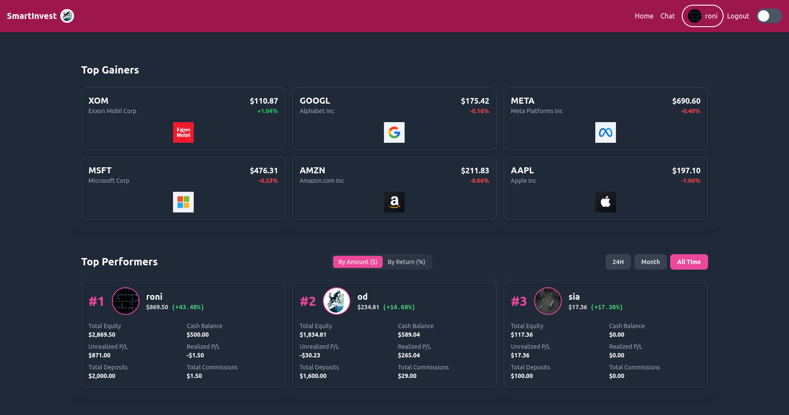
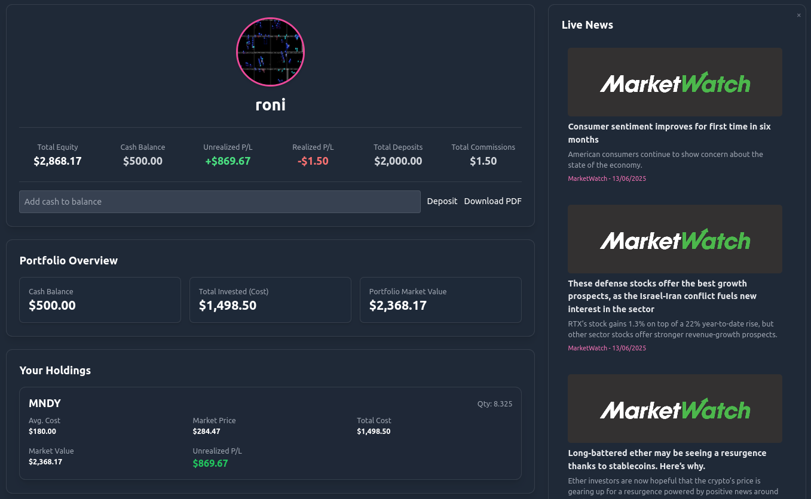
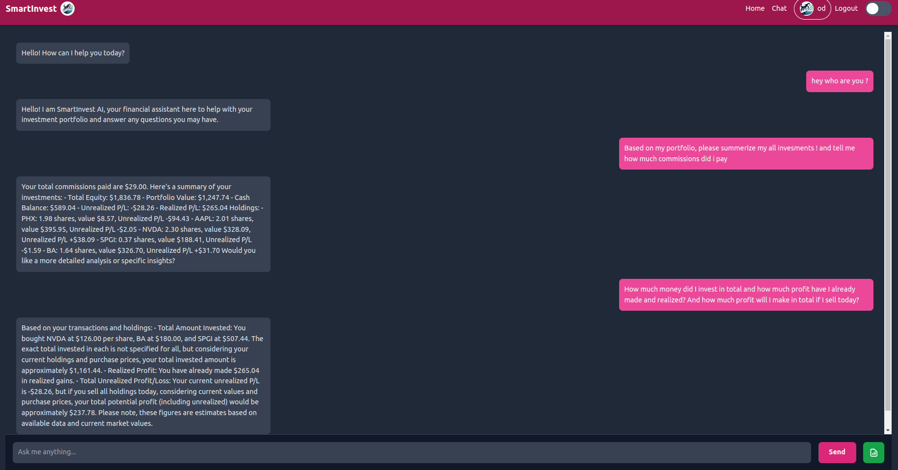
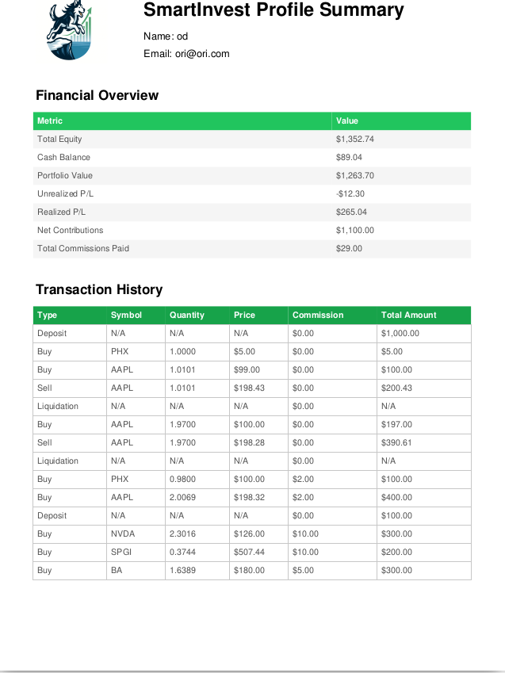
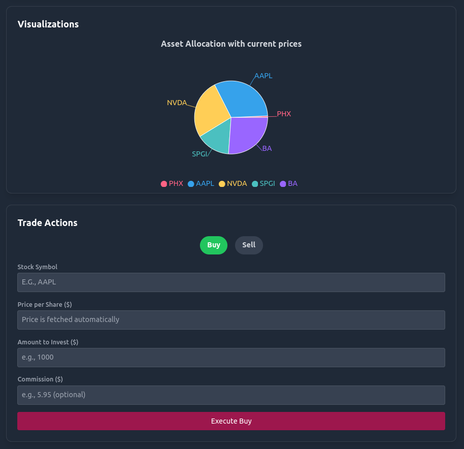

# SmartInvest - Full-Stack Investment Portfolio Application

Welcome to SmartInvest, a comprehensive full-stack application designed to help users track their stock portfolios, discover market trends, and get AI-powered financial advice.

## Features

-   **User Authentication**: Secure login and registration system.
-   **Portfolio Tracking**: Users can add, view, and manage their stock holdings.
-   **Live Financial Data**: Real-time stock prices and performance metrics.
-   **"Hot Stocks" Section**: Displays the top 5 performing stocks of the day, fetched from the Finnhub API with client-side caching.
-   **"Top Performers" Leaderboard**: Ranks users based on their portfolio profit or percentage return.
-   **AI-Powered Chat**: A sophisticated chat interface where users can ask financial questions. The AI is context-aware of the user's personal portfolio for tailored advice.
-   **Client-Side Calculations**: All portfolio statistics are calculated on the client-side to ensure data consistency and real-time accuracy.
-   **RESTful Backend**: A Flask-based backend to manage user data and chat history.

## Screenshots

Here is a glimpse of the SmartInvest application interface.

### Home Page


### User Profile & Portfolio


### AI-Powered Financial Chat


### PDF Report Generation


### System Architecture Diagram


## Tech Stack

-   **Frontend**: React.js, Vite, JavaScript (ES6+), **Tailwind CSS**
-   **Backend**: Python, Flask
-   **Database**: **MongoDB**
-   **APIs & Services**:
    -   **Finnhub**: For real-time stock market data.
    -   **Azure AI Inference**: For the intelligent chat functionality.
-   **State Management**: React Context API for authentication.
-   **Routing**: React Router DOM.
-   **Containerization**: **Docker**

## Getting Started

### Quick Start with Docker (Recommended)

The easiest way to get the entire application running is by using the pre-built Docker image available on Docker Hub. This image contains all the necessary services, dependencies, and configurations.

1.  **Pull the Docker image:**
    ```bash
    docker pull oridaniel10/smartinvest:latest
    ```

2.  **Run the Docker container:**
    ```bash
    docker run -p 3000:80 oridaniel10/smartinvest:latest
    ```
    
3.  **Access the application:**
    Once the container is running, open your web browser and navigate to:
    [http://localhost:3000](http://localhost:

### Local Development Setup

Follow these steps if you want to run the services locally for development purposes.

#### 1. Backend Setup

```bash
# Navigate to the backend directory
cd backend

# Create a virtual environment
python -m venv venv
source venv/bin/activate  # On Windows use `venv\Scripts\activate`

# Install dependencies
pip install -r requirements.txt

# Create a .env file and add your Finnhub API key and MongoDB connection string
# NOTE: You need a running MongoDB instance for this to work.
echo "FINNHUB_API_KEY=YOUR_API_KEY" > .env
echo "MONGO_URI=mongodb://localhost:27017/smartinvest" >> .env


# Run the Flask application
flask run
```
#### 2. Frontend Setup

```bash
# Navigate to the frontend directory in a new terminal
cd frontend

# Install dependencies
npm install

# Create a .env.local file and add your Azure AI credentials
# Get them from https://models.github.ai/inference
echo "VITE_AZURE_AI_ENDPOINT=YOUR_ENDPOINT" > .env.local
echo "VITE_AZURE_AI_KEY=YOUR_KEY" >> .env.local

# Run the React development server
npm run dev
```

---


